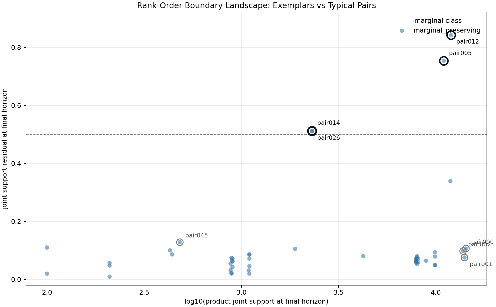
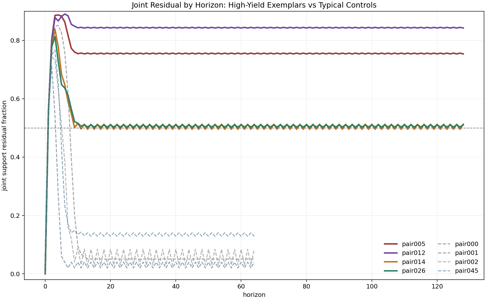
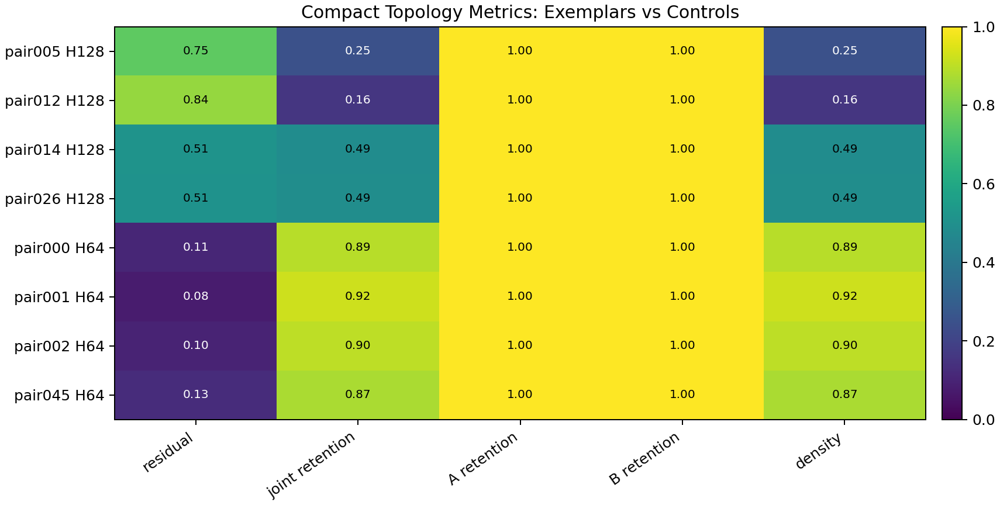

# Future Field Atlas Rank-Order Boundary Visualization Note

Status: completed as retained compact-topology visualization

Date: 2026-06-02

Utility:
`omega.future_field_atlas.visualize_coupled_morphology`

Figure directory:
`docs/research_notes/validation_results/figures/future_field_atlas_rank_order_boundary/`

## Purpose

Produce a first visual comparison of the current high-yield rank-order-boundary
exemplars against the typical coupled landscape.

This is a visualization pass over retained compact artifacts. It does not
reconstruct deleted raw node/edge spools and does not inspect individual joint
edges.

## Inputs

Primary compact source:

```text
results/future_field_atlas/20260602_substrate_morphology_atlas_summary/
```

Horizon traces use retained compact residual tables from:

```text
results/future_field_atlas/20260602_rank_order_boundary_h128_pair005_depth/
results/future_field_atlas/20260602_rank_order_boundary_h128_neighbor_targets/
results/future_field_atlas/20260602_rank_order_boundary_h128_pair026_depth/
results/future_field_atlas/20260602_rank_order_boundary_h64_pair8_medium/
results/future_field_atlas/20260602_rank_order_boundary_h64_class_expansion_p24_47/
```

High-yield exemplars:

```text
pair005
pair012
pair014
pair026
```

Typical/control comparisons:

```text
pair000
pair001
pair002
pair045
```

## Figures

### Landscape Scatter



The scatter places each representative rank-order-boundary pair by final-horizon
product support size and final joint-support residual. The high-yield exemplars
occupy the high-residual / marginal-preserving region. Typical controls remain
low residual, high joint-retention cases.

### Horizon Traces



The horizon trace view shows that the high-yield pairs rapidly rise and then
settle into stable residual bands. Pair012 and pair005 are the strongest
retained exemplars. Pair014 and pair026 settle just above the current
high-yield line. The typical controls drop into low-residual bands.

### Metric Heatmap



The heatmap makes the compact topology contrast explicit: the exemplars have
high residual and low joint retention while preserving both component marginals;
controls preserve both component marginals but keep high joint retention.

## What This Reveals

The visualizations support the current operational read:

```text
The rank-order-boundary high-yield class is not just "large pair size."
It is a marginal-preserving joint-restriction pattern under
symbol_histogram_distance.
```

The plots also make a useful next diagnostic visible:

```text
pair014 and pair026 are near-boundary exemplars around residual 0.51;
pair005 and pair012 are stronger exemplars.
```

That suggests the next representative-control panel should preserve both
strength bands rather than only carrying the strongest cases.

## Claim Boundary

Allowed claim:

```text
The retained compact topology summaries can be visualized in a way that
separates high-yield rank-order-boundary exemplars from typical low-residual
controls.
```

Blocked claims:

```text
Omega validation
agency / identity / valuerhood / value
compatibility detection
support / capture / erasure
interaction detection
raw edge-level mechanism claim
substrate-general theory claim
```

## Next Visualization Improvement

If raw spools are retained for a future small run, the next useful figure would
be a substrate-native joint support matrix for one exemplar and one control:

```text
rows: A frontier states
columns: B frontier states
cell: product-only / coupled-only / both / neither
```

That would show the actual support geometry rather than compact summary
projections.
